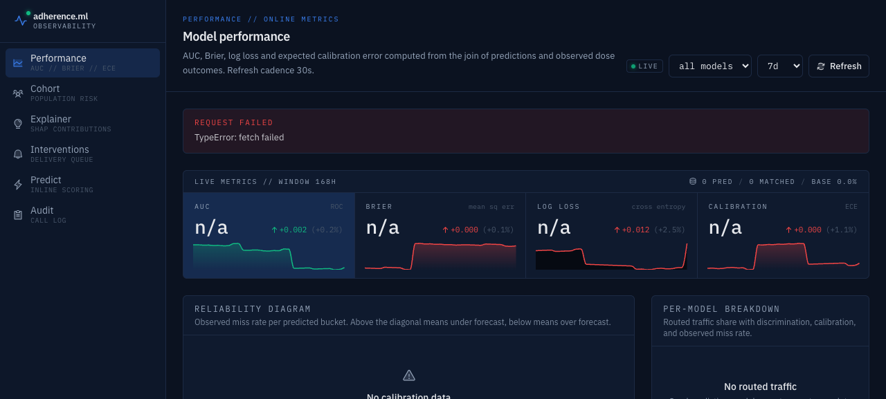

# adherence-ml

ML risk scoring for medication adherence. Predicts which upcoming doses a user
is likely to miss in the next 24 hours and turns those scores into ranked
interventions.



## What it does

The service ingests scheduled-dose events from a med-tracker source, builds
per-user temporal features, and trains an XGBoost + LightGBM ensemble whose
probabilities are calibrated (isotonic) before serving. The FastAPI app exposes
`/v1/predict` for single users and `/v1/cohort/risk` for population sweeps,
plus online quality metrics (AUC, Brier, log-loss, calibration drift) under
`/v1/metrics`. Per-dose SHAP attributions are returned at predict time and
aggregated globally under `/v1/explain`. High-risk doses can be fanned out into
a notification queue with risk-tier policies, quiet hours, per-user mutes, and
notification budgets. Every prediction, override, and delivery is recorded in
an append-only audit log with CSV export.

### Usage and quota

Every `/v1/predict` call is metered against the workspace's active plan
(see `/billing` and `/pricing`). The free tier ships with a 500
requests/day quota (override with `ADHERENCE_FREE_DAILY_QUOTA`). When the
limit is reached the endpoint returns `429` with `x-quota-*` headers and an
`upgrade_url`. Browse the live meter, 30-day request sparkline, and per-key
breakdown at [http://localhost:3000/usage](http://localhost:3000/usage).
Every 200 response carries `x-quota-limit`, `x-quota-used`, and
`x-quota-remaining` so clients can back off before getting throttled.

### Billing and plans

Three self-serve tiers ship in the UI: Free (500 req/day), Pro (25,000
req/day, $49/mo), and Scale (250,000 req/day, $299/mo). Override the
quota numbers with `ADHERENCE_PRO_DAILY_QUOTA` and
`ADHERENCE_SCALE_DAILY_QUOTA`. Visit
[/pricing](http://localhost:3000/pricing) to compare plans and
[/billing](http://localhost:3000/billing) to see the current plan, today's
usage against the new quota, and a change history. Plan changes apply
immediately to `/v1/predict` quota gating, no restart required.

No Stripe key is required to use the flow as shipped: `POST
/api/plan/checkout` records the plan change server side and redirects back
to `/billing?session=<id>`. To wire real payments, replace the body of
`apps/web/app/api/plan/checkout/route.ts` with a Stripe Checkout Session
create call and move the `changePlan` call into a
`checkout.session.completed` webhook handler. The UI does not change.

### Sign in (magic link)

The web app now ships with passwordless email sign-in. Visit
[/login](http://localhost:3000/login), enter your email, and click the link.
Sessions are signed cookies (HMAC-SHA256, 30 day expiry) and persist across
restarts. Set `ADHERENCE_SESSION_SECRET` (16+ chars) in production. In
development the magic link is also surfaced inline on the login page and
logged to stdout so you do not need SMTP wired up to try the flow.

Try it locally:

```bash
# 1. request a link (dev mode echoes it back)
curl -s -X POST http://localhost:3000/api/auth/request \
  -H 'content-type: application/json' \
  -d '{"email":"you@example.com"}'

# 2. follow the dev_link from the response, or open /login in a browser

# 3. confirm the session
curl -s -b cookies.txt http://localhost:3000/api/auth/me
```

The user's email + sign-out control live in the sidebar footer. Anonymous
visitors see a Sign in chip instead.

### Get started in three steps

New workspaces land on [/onboarding](http://localhost:3000/onboarding): a guided
first-run wizard that seeds three sample patient runs, a revoked sample API
key for the curl example, and an inactive demo webhook, then walks the
operator through issuing a real key and saving their first scored patient.
Progress is tracked in `ADHERENCE_DATA_DIR/onboarding.json` and survives
restarts. Try it:

```bash
curl -sS -X POST http://localhost:3000/api/onboarding/seed | jq .
curl -sS http://localhost:3000/api/onboarding | jq .
```

### Install as an app

The web app ships a `manifest.webmanifest`, themed icons, and a dismissible
install chip. On Chrome, Edge, and Android the chip surfaces the native
`beforeinstallprompt`; on iOS Safari it nudges users to use Share then Add
to Home Screen. Dismissals are remembered for 14 days. Launching from the
home screen runs the app standalone with the existing dark theme.

### Settings and your data

Visit [/settings](http://localhost:3000/settings) for the workspace profile
(display name, contact email, org, timezone), notification preferences
(high-risk email, weekly digest, webhook master switch, slow-run toast), and
the data controls. Hit `download .json` to pull a single bundle with every
run, API key (hashes only), usage day-bucket, share link, webhook endpoint,
and delivery attempt. The danger zone wipes every file under
`ADHERENCE_DATA_DIR` after you type the confirmation phrase, so a customer
can honor a GDPR delete request with one click. Try it:

```bash
curl -s http://localhost:3000/api/settings | jq .
curl -s http://localhost:3000/api/settings/export -o adherence-export.json
curl -s -X POST http://localhost:3000/api/settings/wipe \
  -H 'content-type: application/json' \
  -d '{"confirm":"DELETE EVERYTHING"}'
```

### Notifications

An in-app activity feed lives at
[/notifications](http://localhost:3000/notifications) with an unread-badge bell
in the sidebar header. New entries land automatically when a run is saved, a
batch job finishes, or a webhook delivery exhausts its retries. The bell
polls every 30 seconds. Broadcasts (operator announcements with `user_id` of
`null`) are visible to every account but the read state is tracked per user
so marking one read does not silence it for everyone else. Try it:

```bash
curl http://localhost:3000/api/notifications
curl -X POST http://localhost:3000/api/notifications/<id>/read
curl -X POST http://localhost:3000/api/notifications/read-all
```

### Webhooks

Register an HTTP endpoint and adherence.ml will POST a signed JSON envelope to
it every time a run is recorded. Useful for piping risk scores into Slack,
your own analytics, or a downstream nudge engine. Manage endpoints at
[http://localhost:3000/webhooks](http://localhost:3000/webhooks). Endpoints,
attempt history, and counters live in `apps/web/.data/webhooks.json`. The
signing secret is shown exactly once at creation; only a SHA-256 hash is
persisted. Failed deliveries retry with exponential backoff (4 attempts over
~40s) and the last 500 attempts are kept in a delivery log.

Signature header: `X-Adherence-Signature: t=<unix>,v1=<hex>` where
`v1 = HMAC_SHA256(secret_hash, t + "." + raw_body)`. Receivers should reject
requests where `|now - t| > 300s`.

```bash
# 1. register an endpoint, copy the returned `secret`
curl -X POST http://localhost:3000/api/webhooks \
  -H "content-type: application/json" \
  -d '{"name":"slack relay","url":"https://example.com/hooks/adherence"}'

# 2. trigger a real delivery by creating any run
curl -X POST http://localhost:3000/api/runs \
  -H "content-type: application/json" \
  -d '{"kind":"demo","title":"hello","payload":{}}'

# 3. tail the delivery log (filter by status: all|ok|failed|pending)
curl 'http://localhost:3000/api/webhooks/deliveries?status=failed' | jq

# 4. inspect a single delivery (payload + per-attempt status, duration, error)
curl http://localhost:3000/api/webhooks/deliveries/del_XXXX | jq

# 5. redeliver a failed one against its original endpoint (new delivery row,
#    original is preserved for comparison; test pings are excluded)
curl -X POST http://localhost:3000/api/webhooks/deliveries/del_XXXX/redeliver | jq
```

The `/webhooks` dashboard now ships status filter chips, expandable rows
showing the full payload plus per-attempt log, and a one-click `redeliver`
button on every non-test delivery.

### API keys

Issue your own keys for the public `/v1/predict` endpoint and call it from
anywhere. Create, copy, and revoke keys at
[http://localhost:3000/api-keys](http://localhost:3000/api-keys). Keys are
shown exactly once at creation; only a SHA-256 hash and a short prefix are
persisted to `apps/web/.data/api-keys.json`. Each successful call records
last-used and increments a counter, and lands in the same run history under
the `v1` tag.

If a secret leaks, hit `Rotate` on the API keys page (or `POST
/api/keys/<id>/rotate`) to mint a new plaintext in place. Rotation keeps the
key id, name, created date, last-used time, and total call count so charts
and audit trails stay continuous, while the old secret stops working
immediately. Revoked keys cannot be rotated; create a fresh one instead.

```bash
curl -X POST http://localhost:3000/v1/predict \
  -H "authorization: Bearer adh_YOUR_KEY" \
  -H "content-type: application/json" \
  -d '{
    "user_id": "u_123",
    "doses": [
      {"dose_id":"d1","scheduled_at":"2025-01-01T08:00:00Z","dose_class":"statin","dose_strength_mg":20}
    ]
  }'
```

Need to confirm a key works without burning predict quota? `GET /v1/keys/me`
is a read-only introspection endpoint that returns the key id, name, prefix,
scopes, created/last-used timestamps, and total call count. It requires the
`read` scope and never echoes the plaintext or its hash.

```bash
curl http://localhost:3000/v1/keys/me \
  -H "authorization: Bearer adh_YOUR_KEY"
```

### Run history

Every scored prediction, cohort sweep, and forecast call made through the web
app is automatically saved to a per-instance run log under `apps/web/.data/runs.jsonl`
(override path with `ADHERENCE_DATA_DIR`). Open
[http://localhost:3000/history](http://localhost:3000/history) to search,
filter by kind, rename, tag, copy a shareable link (`/history/<id>`), delete,
or export the full log as CSV, JSON, or NDJSON. The History page exports
honor the active search, kind, and date-range filters, so you can pull just
"failed predict runs in the last 7 days" without post-processing. The detail
page is a plain server route so links are shareable in incognito.

API surface:

- `GET /api/runs?q=&kind=&from=&to=&tag=&limit=&offset=` list with search, date range, multi-tag (repeat `tag=` for AND match), pagination
- `POST /api/runs` append a record (validated with zod)
- `GET /api/runs/:id` fetch one
- `PATCH /api/runs/:id` rename or retag (`{ title?, tags? }`)
- `DELETE /api/runs/:id` remove
- `GET /api/runs/tags?kind=` list every tag in use with its run count, optionally narrowed by kind, for the history filter chips
- `GET /api/runs/export?format=csv|json|ndjson&q=&kind=&from=&to=&tag=&user_id=` filtered download (repeat `tag=` to AND multiple)
- `GET /api/runs/:id/download` per-run JSON download (attachment with safe filename)
- `GET /api/runs/:id/share` current public-share status for a run
- `POST /api/runs/:id/share` body `{ enabled: boolean }` mint or revoke a public share link

Share a single run publicly from its detail page with the `Create public link`
button. That mints a 22-character token and exposes the run read-only at
`/share/<token>`. Anyone with the link can view it without signing in, the
owner can revoke it at any time, and the public page is `noindex` so it stays
out of search. Use the `Download JSON` button to grab the full payload as a
timestamped file.

Try it:

```bash
# every cohort run with the "prod" tag from June, as NDJSON
curl -sS 'http://localhost:3000/api/runs/export?format=ndjson&kind=cohort&tag=prod&from=2025-06-01&to=2025-06-30' \
  -o cohort-prod-june.ndjson

# list every tag in use across saved runs with its count
curl -sS 'http://localhost:3000/api/runs/tags'

# runs that carry BOTH the "prod" and "v2" tags (AND match)
curl -sS 'http://localhost:3000/api/runs?tag=prod&tag=v2'
```

The History page renders one clickable chip per tag with its live count, so
you can stack filters (`#prod` + `#v2`) without typing in the search box.
Selecting chips updates the list, pagination, and every CSV/JSON/NDJSON
export link in the toolbar in the same click.

Unit test: `pnpm --filter @adherence/web test`.

### Onboarding

First-run users land at
[http://localhost:3000/onboarding](http://localhost:3000/onboarding):
a three-step checklist (explore the demo, issue an API key, save a run)
with per-step completion tracking and a one-click sample-workspace
seeder. The seeder is idempotent and creates three saved runs across the
demo personas, one demo API key (auto-revoked so it cannot hit
production), and one inactive webhook endpoint at
`https://example.com/adherence/webhook`. State lives in
`apps/web/.data/onboarding.json`. Unit-tested in
`tests/onboarding-store.test.ts`.

```bash
curl http://localhost:3000/api/onboarding
curl -X POST http://localhost:3000/api/onboarding/seed
curl -X PATCH http://localhost:3000/api/onboarding \
  -H 'content-type: application/json' \
  -d '{"step":"explore_demo","done":true}'
```

## Try it

With the API on `:8000` and the web app on `:3000`, open
[http://localhost:3000/demo](http://localhost:3000/demo) for the one-click
demo.

Upgrade plan and inspect quota:

```bash
# Current plan + quota
curl http://localhost:3000/api/plan

# Switch to Pro (applies immediately, recorded in plan history)
curl -X POST http://localhost:3000/api/plan/checkout \
  -H 'content-type: application/json' \
  -d '{"plan":"pro"}'

# Confirm the new daily quota on the usage endpoint
curl http://localhost:3000/api/usage | jq '{quota, used_today, remaining_today}'
```

Then visit [/pricing](http://localhost:3000/pricing) and
[/billing](http://localhost:3000/billing) in the UI.

The original demo flow:

Three preloaded patient personas (stable hypertension, slipping
diabetes plus SSRI, newly prescribed antibiotic course) ship with 14 days of
synthetic dosing history. Picking a persona POSTs the full schedule and
history to `POST /v1/predict` and renders per-dose miss probability, risk
tier, a recharts risk distribution, SHAP-derived reason codes, and observed
call latency against the calibrated ensemble. The landing page at
[http://localhost:3000](http://localhost:3000) still offers an inline
three-card preview, and
[http://localhost:3000/predict](http://localhost:3000/predict) lets you hand
build a dose schedule, see a recharts miss-probability bar chart with risk
thresholds, the round-trip latency in milliseconds, and keeps your last eight
runs on-device for one-click restore. Any result can be published to a
public shareable URL at `/r/<id>` via the new `Share` button, which POSTs
the full request and response to `POST /api/shares` and renders the rendered
result (chart, dose table, reason codes, OpenGraph preview) for anyone with
the link, no account required. Shares persist to `.data/shares.json` next to
the Next.js app and are read back by `GET /api/shares/<id>`.

Every `/r/<id>` link now serves a real 1200x630 OpenGraph PNG at
`/r/<id>/opengraph-image`, generated on the fly with `next/og`. It shows the
run title, kind, top miss probability, risk tier, and tags, so links unfurl
cleanly in Slack, iMessage, X, and LinkedIn. The page also emits matching
`twitter:card` and `og:image` meta tags. Try it locally:

```bash
curl -s -X POST http://localhost:3000/api/runs \
  -H 'content-type: application/json' \
  -d '{"kind":"predict","title":"Persona Alex // morning miss risk","summary":"3 doses scored","payload":{"response":{"predictions":[{"miss_probability":0.78,"risk_tier":"high"}]}},"tags":["demo"]}'
# -> {"id":"<ID>"}
curl -s -o preview.png http://localhost:3000/r/<ID>/opengraph-image
```

Quick share round-trip:

```bash
curl -s -X POST http://localhost:3000/api/shares \
  -H 'content-type: application/json' \
  -d '{
    "user_id":"demo-user-001",
    "top_k":3,
    "rows":[{"dose_id":"d1","scheduled_at":"2026-06-01T12:00:00Z","dose_class":"cardio","dose_strength_mg":10}],
    "result":{"user_id":"demo-user-001","model_version":"v0","predictions":[{"dose_id":"d1","scheduled_at":"2026-06-01T12:00:00Z","miss_probability":0.42,"risk_tier":"medium","reasons":[]}]}
  }'
# -> {"id":"...","url":"/r/..."}  open http://localhost:3000/r/<id>
```
[http://localhost:3000/compare](http://localhost:3000/compare) scores all
three personas in parallel and ranks who needs an intervention first with a
composite triage score and a cohort-wide top-reasons chart aggregated from
the real SHAP attributions.

```bash
curl -s http://localhost:8000/v1/predict \
  -H 'content-type: application/json' \
  -d '{
    "user_id": "demo-cardio-001",
    "doses": [
      {"dose_id": "morning-bb",  "scheduled_at": "2026-06-01T08:00:00Z", "dose_class": "cardio", "dose_strength_mg": 25},
      {"dose_id": "evening-statin", "scheduled_at": "2026-06-01T20:00:00Z", "dose_class": "cardio", "dose_strength_mg": 40}
    ],
    "top_k_reasons": 3
  }' | jq .
```

Project a user's next week of adherence with a confidence interval:

```bash
curl -s 'http://localhost:8000/v1/forecast/user?model_name=default' \
  -H 'content-type: application/json' \
  -d '{
    "user_id": "demo-okafor-daniel",
    "horizon_days": 7,
    "history": [
      {"user_id":"demo-okafor-daniel","dose_id":"metformin-am-d1","scheduled_at":"2026-05-23T15:00:00Z","taken_at":"2026-05-23T15:08:00Z","status":"taken","dose_class":"endocrine","dose_strength_mg":500}
    ]
  }' | jq .
```

## Batch scoring

Upload a CSV of scheduled doses at
[http://localhost:3000/batch](http://localhost:3000/batch) to score up to 500
doses across 50 users in one request. Drop the file, preview the parsed rows,
run, then download the predictions as CSV or JSON. The page rejects oversize
uploads, flags missing columns, and surfaces row-level validation errors
before calling the model. Required columns: `user_id, dose_id, scheduled_at,
dose_class, dose_strength_mg`.

The same endpoint is callable directly. Pipe a CSV file in and add
`?format=csv` to get a CSV download back:

```bash
curl -sS -X POST 'http://localhost:3000/api/batch?format=csv' \
  -H 'content-type: text/csv' \
  --data-binary @doses.csv
```

Or post JSON for a structured response with per-user counts and a summary:

```bash
curl -sS -X POST http://localhost:3000/api/batch \
  -H 'content-type: application/json' \
  -d '{"csv":"user_id,dose_id,scheduled_at,dose_class,dose_strength_mg\nu1,d1,2025-06-01T08:00:00Z,cardio,10\n"}'
```

## Features

- Landing demo (`/`) with three click-to-run patient scenarios, live miss
  probability, risk tier bars, latency, and SHAP reason codes.
- Forecast page (`/forecast`) backed by `POST /v1/forecast/user`: pick a
  persona and horizon (3, 7, or 14 days), see the projected adherence rate
  with a 90 percent bootstrap CI, a daily projection chart, and a per-day
  breakdown of dose count, high-risk doses, and miss probability.
- Cohort browser (`/cohort`) backed by `POST /v1/cohort/risk` with CSV export
  via `/v1/cohort/risk/export`.
- Predict endpoint with batch variant (`POST /v1/predict`, `POST /v1/predict/batch`).
- SHAP-style explainer at predict time and aggregated under
  `/v1/explain/global` and `/v1/explain/sample`, surfaced in the `/explain`
  page as a waterfall chart.
- Intervention queue (`/v1/interventions`, `/v1/interventions/from-predictions`)
  with risk-tier policies, quiet-hours, notification budgets, mutes, ack, and
  expiry sweeps.
- Append-only audit log with stats, listing, and CSV export
  (`/v1/audit/list`, `/v1/audit/stats`, `/v1/audit/export.csv`).
- Calibration and feature-importance pages backed by PNG plots
  (`/v1/plots/calibration.png`, `/v1/plots/importance.png`) and
  `/v1/metrics/calibration-drift`.
- Drift check endpoint (`/v1/drift/check`) with PSI threshold + optional
  webhook.
- Outbound webhook subscriptions with replay (`/v1/webhooks/outbound/*`) and
  inbound med-tracker callback (`/v1/webhooks/medtracker/event`).
- A/B experiments scaffolding (`/v1/experiments/*`).
- Async training jobs via Redis/RQ worker (`POST /v1/train/async`).
- Prometheus metrics (`/metrics`) and OpenTelemetry tracing.

## Stack

- **Web**: Next.js 15 (App Router, React 19), Tailwind v4, Recharts, SWR,
  Phosphor icons. Server-side proxy to the API so API keys never reach the
  browser.
- **API**: FastAPI + Uvicorn, Pydantic v2, SQLAlchemy 2 + Alembic, JWT
  (PyJWT) + API-key auth, Prometheus + OTLP.
- **ML**: scikit-learn, XGBoost, LightGBM, SHAP, isotonic calibration, MLflow
  for tracking, joblib for on-disk model artifacts.
- **Infra**: Postgres 16, Redis 7 (RQ queues), MLflow server, Docker Compose
  for dev. Terraform + Helm scaffolding under `infra/`.
- **CLI**: Typer (`adherence-ml`) for generate-data, train, backtest, predict,
  serve.

## Architecture

```
 med-tracker events ──▶ packages/data ──▶ packages/features ──▶ training frame
                                                                   │
                                                                   ▼
                                                  services/trainer (XGB+LGBM
                                                  ensemble + isotonic calib)
                                                                   │
                                                                   ▼
                                                  models/registry (joblib +
                                                  *_index.json) + MLflow
                                                                   │
            ┌──────────────────────────────────────────────────────┘
            ▼
  services/api  ── /v1/predict, /v1/cohort, /v1/explain, /v1/metrics ──┐
            │                                                          │
            ├──▶ Postgres (audit, policies, mutes, deliveries,         │
            │             experiments, subscriptions)                  │
            ├──▶ Redis + RQ ──▶ services/inference_worker              │
            │                                                          │
            └──────────────────────────────────────────────────────▶ apps/web
                                                              (Next.js 15)
```

Features are derived strictly from events with `event_time < scheduled_at` to
avoid leakage. The trainer registers each model under a name (e.g. `default`)
with a versioned joblib file plus an `<name>_index.json` pointer; the API
loads the active version on first request and supports rollback via
`/v1/admin/models/{name}/rollback`.

## Quick start

Prereqs: Python 3.11 or 3.12, [uv](https://github.com/astral-sh/uv), Node 20+,
pnpm 9, Docker (optional, for Postgres/Redis/MLflow).

```bash
git clone <repo> adherence-ml
cd adherence-ml

# Python install (creates .venv, installs all packages + services)
uv sync --extra dev

# Env
cp .env.example .env

# Option A: full stack via Docker (postgres + redis + mlflow + api + worker + trainer)
./scripts/dev_up.sh

# Option B: local Python only
#   Train a baseline on synthetic data
./scripts/train_baseline.sh
#   Run the API
uv run adherence-ml serve   # or: uv run uvicorn adherence_api.app:create_app --factory --port 7421
```

Web app (separate terminal):

```bash
cd apps/web
cp .env.example .env.local       # set ADHERENCE_API_BASE + ADHERENCE_API_KEY
pnpm install
pnpm dev                          # http://localhost:3000
```

End-to-end smoke (trains a `demo` model and runs a 3-dose predict):

```bash
./scripts/demo_predict.sh
```

## Configuration

API (see `.env.example`):

| Variable | Default | Purpose |
| --- | --- | --- |
| `ADHERENCE_ENV` | `dev` | Environment tag |
| `ADHERENCE_LOG_LEVEL` | `INFO` | Log level |
| `ADHERENCE_API_HOST` | `0.0.0.0` | Bind host |
| `ADHERENCE_API_PORT` | `7421` | Bind port |
| `ADHERENCE_JWT_SECRET` | (required) | HMAC secret for `/v1/admin/token` |
| `ADHERENCE_JWT_ALG` | `HS256` | JWT algorithm |
| `ADHERENCE_JWT_TTL_SECONDS` | `3600` | JWT lifetime |
| `ADHERENCE_API_KEYS` | dev placeholders | `role:key` pairs, comma-separated |
| `ADHERENCE_DB_URL` | local Postgres DSN | SQLAlchemy URL (psycopg) |
| `ADHERENCE_REDIS_URL` | `redis://localhost:6379/0` | Redis for RQ + rate limit |
| `ADHERENCE_MLFLOW_TRACKING_URI` | `http://localhost:5000` | MLflow server |
| `ADHERENCE_MODEL_REGISTRY` | `./models/registry` | Joblib registry path |
| `ADHERENCE_DRIFT_WEBHOOK_URL` | empty | Drift alert webhook |
| `ADHERENCE_DRIFT_PSI_THRESHOLD` | `0.2` | PSI alert threshold |
| `MEDTRACKER_BASE_URL` | empty | Upstream event source |
| `MEDTRACKER_API_KEY` | empty | Upstream auth |
| `OTEL_SERVICE_NAME` | `adherence-ml` | OTel service name |
| `OTEL_EXPORTER_OTLP_ENDPOINT` | empty | OTLP collector |
| `ADHERENCE_SENTRY_DSN` | empty | Sentry DSN; empty disables shipping |
| `ADHERENCE_SENTRY_ENVIRONMENT` | falls back to `ADHERENCE_ENV` | Sentry environment tag |
| `ADHERENCE_SENTRY_TRACES_SAMPLE_RATE` | `0.0` | Performance trace sample rate (0.0 to 1.0) |
| `ADHERENCE_SENTRY_PROFILES_SAMPLE_RATE` | `0.0` | Profiling sample rate (0.0 to 1.0) |

Web (`apps/web/.env.local`):

| Variable | Purpose |
| --- | --- |
| `ADHERENCE_API_BASE` | Backend FastAPI base URL (server-side only) |
| `ADHERENCE_API_KEY` | Admin-role API key for protected routes |

## Scripts

CLI (`uv run adherence-ml ...`):

| Command | What it does |
| --- | --- |
| `version` | Print package version |
| `generate-data` | Write synthetic events parquet to `data/generated/` |
| `train` | Train ensemble (synthetic or from `--events`), register under `--name` |
| `backtest` | Time-series backtest with `--test-days` holdout |
| `predict` | Score a JSON schedule for a user_id, optional `--history` |
| `serve` | Run the FastAPI app via uvicorn |
| `list-models` | List registered model versions |

Shell helpers in `scripts/`:

- `dev_up.sh` — `docker compose -f infra/docker/docker-compose.dev.yml up --build`
- `train_baseline.sh` — generate-data + train `default` + list-models
- `demo_predict.sh` — train `demo` then call `predict` on 3 sample doses
- `export_openapi.py` — dump the OpenAPI schema

Web (`apps/web`, pnpm):

| Script | What it does |
| --- | --- |
| `pnpm dev` | Next dev server on :3000 |
| `pnpm build` | Production build |
| `pnpm start` | Production server on :3000 |
| `pnpm lint` | `next lint` |
| `pnpm typecheck` | `tsc --noEmit` |

## API

All routes are under `/v1` unless noted. Auth is API key (`x-api-key`) or JWT
(`Authorization: Bearer ...`); roles are `admin`, `service`, `viewer`.

Health & ops

- `GET /healthz`, `GET /livez`
- `GET /metrics` (Prometheus text)

Predict

- `POST /v1/predict`
- `POST /v1/predict/batch`

Cohort

- `POST /v1/cohort/risk`
- `POST /v1/cohort/risk/export` (CSV)

Explain

- `GET /v1/explain/global`
- `GET /v1/explain/sample`

Forecast

- `POST /v1/forecast/user`

Train (admin)

- `POST /v1/train`
- `POST /v1/train/async`

Drift

- `POST /v1/drift/check`

Plots

- `GET /v1/plots/calibration.png`
- `GET /v1/plots/importance.png`

Metrics (online quality)

- `GET /v1/metrics/online`
- `GET /v1/metrics/online/report`
- `GET /v1/metrics/calibration-drift`

Audit (admin)

- `GET /v1/audit/list`
- `GET /v1/audit/stats`
- `GET /v1/audit/shadow`
- `GET /v1/audit/export.csv`

Interventions

- `POST /v1/interventions`
- `POST /v1/interventions/from-predictions`
- `POST /v1/interventions/{delivery_id}/ack`
- `GET  /v1/interventions/deliveries/{user_id}`
- `GET  /v1/interventions/stats`
- `POST /v1/interventions/expire`

Policies

- `GET /v1/policies/risk`, `PUT /v1/policies/risk`, `DELETE /v1/policies/risk`
- `PUT/GET/DELETE /v1/policies/quiet-hours/{user_id}`
- `PUT/GET/DELETE /v1/policies/notification-budget/{user_id}`

Mutes

- `PUT/GET/DELETE /v1/users/{user_id}/mute`
- `GET /v1/admin/mutes`

Experiments

- `POST /v1/experiments`, `GET /v1/experiments`, `GET /v1/experiments/{key}`
- `PATCH /v1/experiments/{key}/state`
- `POST /v1/experiments/{key}/assign`
- `POST /v1/experiments/{key}/events`
- `GET /v1/experiments/{key}/results`

Webhooks

- Inbound: `POST /v1/webhooks/medtracker/event`, `GET /v1/webhooks/medtracker/recent`
- Outbound: `PUT/GET /v1/webhooks/outbound/subscriptions`,
  `DELETE /v1/webhooks/outbound/subscriptions/{name}`,
  `GET /v1/webhooks/outbound/deliveries`,
  `POST /v1/webhooks/outbound/deliveries/{delivery_id}/replay`,
  `POST /v1/webhooks/outbound/test-send`

Admin

- `POST /v1/admin/token`
- `GET  /v1/admin/models`
- `POST /v1/admin/models/{name}/rollback`
- `POST /v1/admin/api-keys`, `GET /v1/admin/api-keys`,
  `POST /v1/admin/api-keys/{name}/revoke`
- `POST /v1/admin/audit/retention`

The full OpenAPI is available at `/docs` (Swagger) and `/openapi.json`, or
dump it with `uv run python scripts/export_openapi.py`.

## Model

Per-dose binary classifier (`label = dose missed`). The ensemble averages
calibrated XGBoost and LightGBM probabilities (`packages/models/adherence_models/ensemble.py`),
fit with isotonic calibration on a held-out slice
(`packages/models/adherence_models/calibration.py`). Training and evaluation
metrics include ROC AUC, PR AUC, Brier score, log loss, and reliability bins
(`packages/eval/adherence_eval`).

Features (`packages/features/adherence_features/engineering.py`,
`FEATURE_COLUMNS`):

```
hour_sin, hour_cos, dow_sin, dow_cos, is_weekend,
time_bucket_idx, dose_class_idx, dose_strength_mg,
streak_taken, streak_missed,
recent_miss_rate_7d, recent_miss_rate_24h, recent_late_rate_7d,
doses_today_so_far, doses_yesterday,
minutes_since_last_dose, minutes_since_last_taken,
sleep_window_proxy, n_classes_user, user_n_doses_history
```

All features are computed from events strictly before `scheduled_at` to avoid
leakage.

Artifacts live in `models/registry/` as
`<name>__<UTC timestamp>.joblib` with a sibling `<name>_index.json` pointing at
the active version. The registry is loaded by `packages/models/adherence_models/registry.py`.
Rollback via `POST /v1/admin/models/{name}/rollback`.

Retrain:

```bash
# synthetic
uv run adherence-ml train --synthetic --users 5000 --days 60 --name default

# from a parquet of real events
uv run adherence-ml train --no-synthetic --events data/events.parquet --name default

# time-series backtest
uv run adherence-ml backtest --synthetic --users 2000 --days 45 --test-days 7
```

## Project structure

```
adherence-ml/
├── apps/
│   └── web/                    # Next.js 15 dashboard (cohort, predict,
│                               # explain, interventions, audit, dashboard)
├── packages/
│   ├── common/                 # settings, logging, telemetry, constants
│   ├── data/                   # synthetic generator, loaders, medtracker
│   ├── features/               # engineering.py (FEATURE_COLUMNS), drift.py
│   ├── models/                 # ensemble, calibration, registry, promotion
│   ├── eval/                   # metrics + reliability plots
│   └── explain/                # SHAP wrappers
├── services/
│   ├── api/                    # FastAPI app + routes/
│   ├── trainer/                # training pipeline (run_training, run_backtest)
│   ├── inference_worker/       # predict_doses, RQ worker
│   └── cli/                    # adherence-ml Typer CLI
├── clients/
│   ├── python/                 # generated Python client
│   └── typescript/             # generated TS client
├── infra/
│   ├── docker/                 # Dockerfile, Dockerfile.{trainer,worker},
│   │                           # docker-compose.dev.yml
│   ├── helm/adherence-ml/
│   └── terraform/
├── scripts/                    # dev_up.sh, train_baseline.sh,
│                               # demo_predict.sh, export_openapi.py
├── models/registry/            # joblib artifacts + *_index.json
├── data/samples/               # sample events
├── mlruns_sample/              # sample MLflow run
├── tests/                      # unit, property (hypothesis), integration
├── docs/                       # screenshots, diagrams
├── pyproject.toml              # uv-managed; defines adherence-ml entrypoint
└── uv.lock
```

## Operations

Deployment and on-call notes for running adherence-ml in production.

**Deploy.** Build the API image and ship via `infra/helm/adherence-ml`. The chart provisions API + worker + trainer deployments, a PodDisruptionBudget, optional HPA, ingress, and projects environment from a ConfigMap plus a Secret. Override the image tag and secrets per environment with `--values`.

**Scale.** API replicas default to 2 (`replicaCount.api`). Enable horizontal autoscaling with `autoscaling.enabled=true`; the api HPA scales on CPU (target 70 percent) and memory (target 80 percent) so a slow leak triggers scale-out instead of OOMKills (set `autoscaling.targetMemoryUtilizationPercentage=0` to opt out). The HPA carries a `behavior` block that biases scale-up aggressive (no stabilization, up to 100 percent or 4 pods per 30s) and scale-down conservative (5 minute stabilization window, max 1 pod per minute) so the fleet does not flap during diurnal load. Workers scale independently with `replicaCount.worker`; flip `autoscaling.worker.enabled=true` to bring up a CPU-targeted worker HPA (min 1, max 8, target 75 percent, 10 minute scale-down stabilization so transient queue drains do not yank workers mid-job). The worker HPA stays CPU-only by design until a Redis queue-depth metric adapter ships; size `replicaCount.worker` for peak queue depth and let the HPA absorb the rest. Chart rendering is pinned by `tests/unit/test_helm_autoscaling.py`.

**Backup.** Postgres holds the audit log, intervention queue, policies, mutes, deliveries, experiments, and webhook subscriptions. Take logical backups with `pg_dump` against `ADHERENCE_DB_URL` on a schedule and verify restores quarterly. Model artifacts live in `ADHERENCE_MODEL_REGISTRY` (joblib + `*_index.json` pointer); snapshot the registry volume after every training run that promotes a new active version.

**Error tracking (Sentry).** Set `ADHERENCE_SENTRY_DSN` to ship unhandled errors and traces from the API and inference worker. Sample rates are tunable via `ADHERENCE_SENTRY_TRACES_SAMPLE_RATE` and `ADHERENCE_SENTRY_PROFILES_SAMPLE_RATE` (both default 0.0). The integration covers FastAPI, Starlette, SQLAlchemy, and RQ, with a `before_send` hook that scrubs `Authorization`, `X-API-Key`, and `Cookie` headers plus any `api_key` or `token` query string before events leave the process. `send_default_pii` is forced off. In Helm, populate `secrets.sentryDsn` and tune `env.ADHERENCE_SENTRY_*` per environment. Leaving the DSN empty keeps Sentry fully disabled.

**Network policy.** The Helm chart ships default-deny `NetworkPolicy` objects for the `api`, `worker`, and `trainer` deployments, gated behind `networkPolicy.enabled` (off by default for backward compatibility with clusters whose CNI does not enforce NetworkPolicy or whose dependency pod labels differ). When enabled, ingress to the api is restricted to pods matching `networkPolicy.api.fromLabels` (defaults to `ingress-nginx`), any namespaces in `networkPolicy.api.fromNamespaceLabels`, optional Prometheus scrape from `networkPolicy.prometheusNamespaceLabels`, and same-chart sidecars when `networkPolicy.api.allowSameChart=true`. Workers accept ingress only from the api component; trainers accept none. All three pods may egress to kube-dns plus the in-cluster Postgres / Redis / MLflow selectors under `networkPolicy.egress.*` and any SaaS CIDRs listed in `networkPolicy.egress.extraCIDRs` (Sentry ingest, OTLP collector, med-tracker upstream). Before enabling in a new cluster, confirm the `podLabels` in `values.yaml` match your Postgres, Redis, and MLflow installs (Bitnami charts use `app.kubernetes.io/name: postgresql` / `redis` / `mlflow`).

**On-call.** Probe liveness at `/livez`, readiness at `/readyz`, and aggregate status at `/healthz`. `/livez` always returns 200 while the event loop is responsive (process-up signal only). `/readyz` returns 200 only when the database is reachable and at least one model is loaded; it returns 503 otherwise so Kubernetes removes the pod from Service endpoints. Redis is treated as a soft dependency by default because predict and cohort routes still serve without it; set `ADHERENCE_READYZ_REQUIRE_REDIS=true` in environments where async queues are on the critical path. `/healthz` always returns 200 with a JSON `status` field of `ok` or `degraded` and is kept for dashboards that depend on the 200; do not point Kubernetes probes at it. Scrape `/metrics` for request volume, latency, queue depth, calibration drift, and rate-limit rejects. Drift alerts fire to `ADHERENCE_DRIFT_WEBHOOK_URL` when PSI crosses `ADHERENCE_DRIFT_PSI_THRESHOLD` (default 0.2). Rotate API keys via `ADHERENCE_API_KEYS` (`role:key` pairs); JWT signing key is `ADHERENCE_JWT_SECRET` (minimum 16 chars, enforced at boot). After model promotion regressions, roll back with `POST /v1/admin/models/{name}/rollback`.

**Data subject requests (GDPR).** Subject access and erasure are served at:

* `GET    /v1/users/{user_id}/data`  returns every row that references the user across `predictions`, `prediction_audit`, `dose_outcomes`, `intervention_deliveries`, `user_mutes`, `quiet_hours_policies`, `notification_budgets`, `user_risk_policies` (scope `user`), `experiment_exposures`, and `experiment_events`. Response is JSON with per-table row counts and a stable schema so snapshots can be diffed.
* `DELETE /v1/users/{user_id}/data`  hard-deletes the same set inside a single transaction and returns per-table delete counts. Idempotent: a second call returns zero. Aggregate `training_runs` rows are intentionally retained because they no longer identify the subject after row-level deletion; trigger `POST /v1/train/async` afterwards if a re-fit without the user's data is required.

Both endpoints require either the `admin` role or a DB-issued API key carrying `gdpr:read` (export) or `gdpr:erase` (delete). Every call is structured-logged with `caller`, `request_id`, and per-table counts so the access can be reconstructed from log retention. Verify the data subject's identity out-of-band before invoking these endpoints.

**Browser security headers.** Every API response carries a hardened header set from `SecurityHeadersMiddleware`: `X-Content-Type-Options: nosniff`, `X-Frame-Options: DENY`, `Referrer-Policy: strict-origin-when-cross-origin`, `Cross-Origin-Opener-Policy: same-origin`, `Cross-Origin-Resource-Policy: same-site`, and a `Permissions-Policy` that disables camera, microphone, geolocation, payment, USB, magnetometer, gyroscope, and accelerometer. HSTS is opt-in: set `ADHERENCE_HSTS_ENABLED=true` in environments served over TLS (tune `ADHERENCE_HSTS_MAX_AGE_SECONDS`, `ADHERENCE_HSTS_INCLUDE_SUBDOMAINS`, `ADHERENCE_HSTS_PRELOAD`). Keep it off in local dev so plain-HTTP `curl` flows are unaffected. `ADHERENCE_CSP_POLICY` is empty by default because the API returns JSON and PNG only and the Next.js front end enforces its own CSP at the edge; set it to a full policy string to emit a global `Content-Security-Policy` header. The middleware never overwrites a header that an upstream proxy or a specific route already set, so per-response CSP overrides keep working. Disable the whole middleware with `ADHERENCE_SECURITY_HEADERS_ENABLED=false` if a fronting reverse proxy already injects the same set.

**Request body size limit.** `BodySizeLimitMiddleware` caps inbound POST/PUT/PATCH bodies and returns HTTP 413 (`{"detail": "request body too large", "limit_bytes": <int>, "received_bytes": <int>}`) above the threshold. Two enforcement paths: a fast `Content-Length` check that rejects oversize requests before the body is read, and a streaming tally that wraps the ASGI receive callable for chunked uploads where `Content-Length` is missing or untrusted. Global default is 1 MiB via `ADHERENCE_MAX_BODY_BYTES` (Helm: `env.ADHERENCE_MAX_BODY_BYTES`), which fits a several-thousand-dose schedule with headroom. Per-route overrides ship with the `with_max_body(n)` decorator from `adherence_api.body_size_middleware`; attach it above an endpoint to raise the cap on cohort bulk imports or lower it on admin write paths. Health probes (`/livez`, `/healthz`, `/readyz`), `/metrics`, and OpenAPI paths are exempt so liveness stays green even with a misconfigured tiny limit. Disable the whole middleware with `ADHERENCE_BODY_SIZE_LIMIT_ENABLED=false` if a fronting reverse proxy (nginx `client_max_body_size`, Envoy `max_request_bytes`) already enforces the cap. Rejected requests are structured-logged with path, method, observed bytes, and the configured limit, and are counted in the `adherence_api_requests_total{status="413"}` Prometheus series so a sudden spike in 413s is visible on the same dashboard as 5xx.

**Admin-plane audit log.** Every privileged mutation on `/v1/admin/*` and `/v1/users/{user_id}/data` writes a row to `admin_audit_log` via `record_admin_action()` in `adherence_common.admin_audit`. Captured actions: `token.mint`, `api_key.create`, `api_key.revoke`, `model.rollback`, `retention.sweep`, and `gdpr.erase`. Each row stores `tenant_id`, `request_id`, `action`, `target` (api key name, model name, or user_id), `caller`, `caller_role`, `ok`, `error`, and a redacted JSON `details` blob with request-shaped context. Failed authorisation and validation paths record `ok=false` rows so denied attempts are auditable, not just successful ones. The redactor scrubs `key`, `api_key`, `token`, `secret`, `password`, `authorization`, `x-api-key`, `cookie`, and `dsn` fields (case insensitive, walks nested dicts and lists) before persistence, so raw API keys minted by `POST /v1/admin/api-keys` never reach the audit row. Read recent rows with `GET /v1/admin/audit/admin?action=<verb>&caller=<sub>&limit=<n>`; non-admin roles are blocked by `require_admin`. Tenant scoping mirrors the prediction audit reader: callers default to their own tenant, admins may pass `?tenant=<id>` or `?tenant=*` for a cross-tenant compliance read. The recorder swallows its own SQLAlchemy failures (logs a `admin_audit_persist_failed` structured event) so a transient database hiccup never blocks the underlying admin operation; pair the route with the existing `/metrics` request counter to spot audit gaps.

**Audit log tamper evidence.**Every `prediction_audit` row is chained: on insert the recorder reads the previous row's `row_hash`, stores it in `prev_hash`, then writes `row_hash = sha256(canonical_payload(row) + prev_hash)`. Hashed fields cover `id`, `request_id`, `route`, `user_id`, `caller`, `caller_role`, `model_name`, `model_version`, shadow model identifiers, dose counts, miss-probability summaries, `shadow_max_divergence`, `ok`, `error`, `response_summary`, and `created_at`. Latency is excluded so environment jitter does not invalidate the chain. Compliance jobs verify integrity with `GET /v1/audit/verify` (admin only); the response carries `n_rows`, `n_hashed`, `head_hash`, and a `breaks` list of `{row_id, reason, expected, actual}`. `reason` is `row_hash_mismatch` (a row was edited in place) or `prev_hash_mismatch` (a row was deleted or reordered). Rows written before this feature shipped have NULL `row_hash` values and are tolerated as long as the next chained row restarts with `prev_hash = NULL`; back-fill them out-of-band if a fully covered chain is required for an audit window.

**Prometheus monitoring.** The api process renders text exposition at `GET /metrics` via `adherence_common.prom` (no auth: lock down with `networkPolicy`). The Helm chart ships first-class Prometheus Operator wiring under `monitoring.*`, all disabled by default so vanilla clusters render cleanly. Enable per environment:

* `monitoring.serviceMonitor.enabled=true` installs a `ServiceMonitor` (CRD `monitoring.coreos.com/v1`) selecting the api Service on the named `http` port, scraping `/metrics` every `monitoring.serviceMonitor.interval` (30s default). Set `monitoring.serviceMonitor.additionalLabels.release=<kube-prometheus-stack release>` so the Operator's `serviceMonitorSelector` picks it up. `relabelings` and `metricRelabelings` are pass-through for custom topology labels.
* `monitoring.prometheusRule.enabled=true` installs a `PrometheusRule` with five alerts wired to real metrics emitted by `adherence_common.prom`: `AdherenceApiHighErrorRate` (5xx ratio from `adherence_api_requests_total{status=~"5.."}`), `AdherenceApiHighLatencyP95` (p95 from `adherence_api_request_duration_ms_bucket`), `AdherenceApiNoTraffic`, `AdherenceApiNoModelLoaded` (from the `adherence_model_loaded` gauge), and `AdherenceApiTargetDown`. Thresholds live in `monitoring.prometheusRule.thresholds.*` (error rate 5 percent for 10m, p95 750ms for 10m, scrape down 5m) and can be tuned without forking the template.
* `monitoring.podAnnotations.enabled=true` and `monitoring.serviceAnnotations.enabled=true` add `prometheus.io/scrape`, `prometheus.io/path=/metrics`, and `prometheus.io/port=7421` for classic kubernetes_sd scrape configs that do not use the Operator. Leave both off when the Operator is in use to avoid duplicate scrapes.

When `networkPolicy.enabled=true`, ingress from the Operator's Prometheus pods is already permitted via `networkPolicy.api.allowPrometheusScrape=true` and `networkPolicy.api.prometheusNamespaceLabels` (defaults to `name: monitoring`). Render and diff the chart with `helm template adh infra/helm/adherence-ml --set monitoring.serviceMonitor.enabled=true --set monitoring.prometheusRule.enabled=true` to inspect the manifests before applying. Chart sanity is enforced by `tests/unit/test_helm_monitoring.py`, which renders the chart with `helm template` and asserts every alert references a metric defined in `adherence_common.prom`.

**Pod and container hardening.** The Helm chart applies a Pod Security Standards "restricted" posture to every Deployment (`api`, `worker`, `trainer`) by default. Pods run as non-root uid 1001 with `fsGroup` 1001 and `seccompProfile: RuntimeDefault`; containers drop all Linux capabilities, block privilege escalation, and mount the root filesystem read-only. Scratch space for `/tmp` and framework caches is backed by `emptyDir` volumes declared in `securityContext.writableDirs` so a read-only rootfs stays usable without surrendering write access to the image layers. Defaults match what `infra/docker/Dockerfile` already prepares (uid 1001, `libgomp1` only, no shell tooling beyond what XGBoost and LightGBM need at runtime). Disable per environment with `--set securityContext.enabled=false` only if the target cluster cannot honor PSA restricted (older PSP setups requiring privileged sidecars). Tune the writable mounts via `securityContext.writableDirs[].sizeLimit` when batch trainer caches need more than the default 64 MiB. Chart rendering is pinned by `tests/unit/test_helm_security_context.py`, which asserts every rendered Deployment carries `runAsNonRoot`, `readOnlyRootFilesystem`, `allowPrivilegeEscalation=false`, dropped capabilities, and a writable `/tmp` mount.

**Supply chain security.** CI (`.github/workflows/ci.yml`, gated on repo variable `ENABLE_CI=1`) runs four security jobs in parallel with the unit tests, all required before the Docker build can run:

* `pip-audit` resolves the full uv environment and scans every installed Python dependency against the PyPI advisory database. JSON report uploaded as the `pip-audit-report` artifact (30-day retention). New CVEs surface on the run summary without blocking unrelated merges.
* `bandit` runs SAST on `packages/` and `services/` with `bandit.yaml` (excludes tests, vendored code, the web UI, and infra). Severity gate is MEDIUM (`-ll`); the build fails on any medium or high finding. Justified false positives are annotated inline with `# nosec BXXX` and a one-line reason. JSON report uploaded as `bandit-report`.
* `sbom` generates a CycloneDX 1.5 SBOM (`sbom.cdx.json`) for the resolved runtime environment via `cyclonedx-py environment`. Uploaded with 90-day retention for SOC2 evidence and downstream vuln triage.
* `trivy` rebuilds `adherence-ml:ci` and scans the image for HIGH and CRITICAL OS + library vulnerabilities, ignoring unfixed. SARIF output uploaded as `trivy-sarif` for GitHub code scanning integration.

The `docker` and `trivy` jobs depend on `pip-audit` and `bandit` passing, so a known-vulnerable build never reaches a published image. Workflow shape and bandit config are pinned by `tests/unit/test_ci_security.py`, which fails locally if a required job, gate, dependency, or artifact upload is removed. To run the same gates locally before pushing:

```
uv run bandit -c bandit.yaml -r packages services -ll
uv pip install pip-audit cyclonedx-bom
uv run pip-audit --strict
uv run cyclonedx-py environment --output-format JSON --output-file sbom.cdx.json
```

**CORS hardening.** The API mounts FastAPI `CORSMiddleware` with explicit allowlists wired to settings: `ADHERENCE_API_CORS_ORIGINS`, `ADHERENCE_API_CORS_METHODS`, `ADHERENCE_API_CORS_HEADERS`, `ADHERENCE_API_CORS_ALLOW_CREDENTIALS`, and `ADHERENCE_API_CORS_MAX_AGE_SECONDS`. List values accept comma-separated env strings (`ADHERENCE_API_CORS_ORIGINS="https://app.example.com,https://admin.example.com"`). Two boot-time guards live on the pydantic settings model. First, the combination `api_cors_origins=["*"]` plus `api_cors_allow_credentials=true` is rejected because browsers reject the response anyway per the Fetch spec and shipping that config silently breaks every credentialed XHR. Second, when `ADHERENCE_ENV=prod` the validator refuses `["*"]` for origins, methods, or headers so a misconfigured prod deploy fails to start instead of silently exposing the API to every origin. The Helm chart ships `ADHERENCE_ENV=prod` plus an explicit origin (`https://adherence.example.com`) and a curated method/header allowlist; override per environment via `--set-string env.ADHERENCE_API_CORS_ORIGINS=...`. The middleware exposes `X-Request-ID` so browser clients can correlate against server logs without an extra preflight. Dev defaults remain permissive (`*` origins, no credentials) so local `curl` and the Next.js dev server keep working. Unit coverage in `tests/unit/test_cors.py` exercises both validators and asserts the running app echoes allowed origins while ignoring disallowed ones.

**Multi-tenant scoping.** Every PII-bearing write stamps a `tenant_id` (default `"default"`) from the calling principal so audit, predictions, and intervention deliveries can be filtered without cross-tenant leakage. Tenants land on the principal three ways: DB-issued API keys carry `tenant_id` set at creation time via `POST /v1/admin/api-keys` (`{"name": ..., "role": ..., "tenant_id": "acme"}`) and surface again on `GET /v1/admin/api-keys`; JWTs minted via `POST /v1/admin/token` accept a `tenant` field that becomes the `tenant` claim and is read back on every request; legacy env-mapped keys in `ADHERENCE_API_KEYS` fall through to `ADHERENCE_DEFAULT_TENANT`. The audit reader `GET /v1/audit/list` and exporter `GET /v1/audit/export.csv` default to the caller's tenant and accept `?tenant=<id>` only when the caller is admin role; admins may pass `?tenant=*` for a cross-tenant compliance read. Non-admin callers asking for a tenant other than their own get HTTP 403 with an explicit `tenant mismatch` detail. Tenant id is included in the tamper-evident audit hash chain so swapping a row's tenant after the fact breaks `GET /v1/audit/verify`. New columns are added in place by `init_db()` via an idempotent inspector-driven `ALTER TABLE` so existing deployments converge without a separate alembic step; pre-existing rows get the `default` tenant.

## License

MIT. See `LICENSE`.

